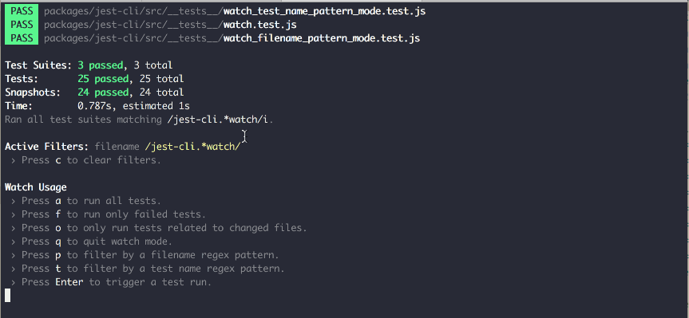
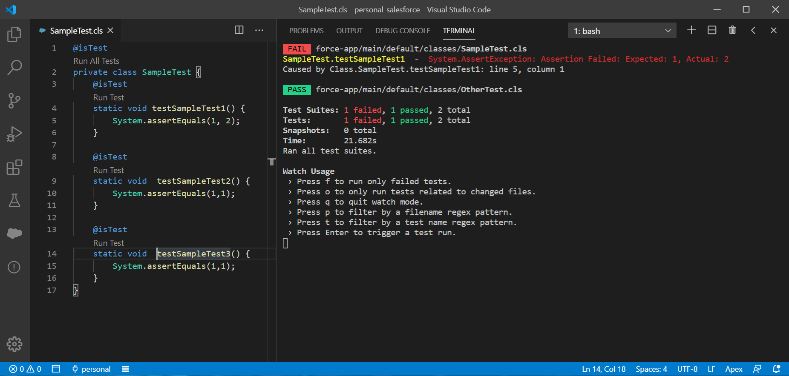

**tl;dr:** Created a proof of concept showing what it might be like to run Salesforce Apex tests using Jest.

[Git Repository for Proof of Concept. ](https://github.com/dv297/jest-apex-test-runner)

---

I recently joined a new company and started my first Salesforce engineering position! I knew almost nothing about
Salesforce before I joined. My position prior to this new position was primarily in the JavaScript ecosystem, writing
React SPA's. I've enjoyed my time with the new company but one of the things that I've missed recently is some of the
tooling and developer experience that the JavaScript ecosystem had. In particular, one tool always felt really good to
use: [Jest](https://jestjs.io/).

Jest is a popular JavaScript testing framework. Salesforce developers might be familiar with Jest if they are testing
their Lightning Web Components. But to me, some of the best benefits of Jest really have nothing to do with JavaScript.
Two things stand out for me when I use Jest:

## Watch Mode

Jest has a feature called "interactive watch mode". When it is turned on, anytime that you change your code, it
immediately runs the tests. Why is this important?

- When you change a line of code, you get immediate feedback if the change you just made broke tests. Sometimes you are
  expecting to break the test by changing the code. But sometimes it is a surprise. By getting that immediate feedback,
  you can feel confident that the very last thing you changed was probably the thing that caused the test to break.
- It runs the tests with no friction: When you make a change, you don't have to navigate to another folder in your
  editor and manually run things. Less clicks, less context switching, more focus, and more productivity! I usually keep
  my code on one screen and a terminal on my second monitor.

## Filtering Which Tests to Run



Jest has a feature to allow to you easily filter which tests you want to run. If you already know specific tests are
failing, maybe it's not super important to run the tests that already passed. Or maybe you're just changing a specific
part of your codebase and want to only focus on the tests for those specific concepts. Whatever it is, Jest makes it
really to filter which tests you want to run to make sure you stay focused and productive.

## Disclaimer

Just to reiterate, this is all a "proof-of-concept". Only the bare minimum have been built out to show how something
like this could be approached. I think sharing this is helpful from an educational point-of-view and possibly inspire
someone to fully take on the project.

Obviously there are things that would need to be included before this could be production-ready, and for blog brevity, I
don't explain every single concept. Still, I hope readers find this useful!

## Building the Custom Test Runner to Run Apex Tests with Jest

Jest is generally used to run "JavaScript" tests, meaning it knows how to run JavaScript and TypeScript tests. However,
the community behind Jest have designed Jest to be more than just a JavaScript test runner. They opened a lot of their
internal tools that allows us to extend Jest's capabilities, and Rogelio Guzman did an amazing talk on this called
[Jest as a platform](https://www.youtube.com/watch?v=NtjyeojAOBs).

One of the slides Rogelio shared showed the lifecycle of a test run. He shows that Jest has 3 major parts of a test run:

- Jest finding the files
- Jest running the tests for those files (the test runner)
- Jest reporting the results

In his example, he builds on this idea that we can build on top of these 3 lifecycle portions. He takes us through an
example of running Mocha tests (another JavaScript testing framework) using Jest by replacing the test runner. He even
does this with running ESLint, a static code analysis tool, using Jest.

**This is perfect for us because it means that we can write a custom test runner for running Apex tests in Jest.**

To make things even easier, Rogelio created an NPM package called
[create-jest-runner](https://www.npmjs.com/package/create-jest-runner) that gives you the tools to make a Jest test
runner. To begin, we install create-jest-runner and create an "entry point" to our test runner.

```javascript
// index.js
const { createJestRunner } = require('create-jest-runner')
module.exports = createJestRunner(require.resolve('./run.js'))
```

From there, we create a `run.js` file that contains what happens when we run the tests.

```javascript
module.exports = options => {}
```

Cool, so now we have a function that will run when we run an Apex test. But how do we actually run a test? Salesforce
developers might be familiar with "Salesforce DX", a movement to modernize the Salesforce developer experience. One part
of Salesforce DX is the Salesforce CLI, a command line interface for doing almost anything you can imagine with
Salesforce, such as creating a scratch org or deploying new code, all through command line scripts you can automate. The
Salesforce CLI has a command for running tests called `sfdx force:apex:test:run`. Below is how you might use it.

```bash
$ sfdx force:source:deploy --sourcepath SampleTest.cls --json --loglevel fatal
```

So we have a command line that we can run, but we need to be able to run this from JavaScript. Whenever I need to do
something like this, I like to reach for [shelljs](https://www.npmjs.com/package/shelljs). I'm sure there is a native
way to do this in NodeJS but the API for shelljs is easy to understand and relatively well documented! And we can
replace the filename in the command using the builtin `path` library.

```javascript
const path = require('path')

module.exports = options => {
  const { testPath } = options

  const testFileName = path.basename(testPath, '.cls')

  // Send request to Salesforce to execute tests
  const testExecution = JSON.parse(
    shell.exec(`sfdx force:apex:test:run --tests ${testFileName} --resultformat human --loglevel error --json`, {
      silent: true,
    })
  )
}
```

Now, when we run the tests using the CLI and include the `--json` flag, we get the results in the following structure
(some properties stripped for readability):

```json
{
  "result": {
    "summary": {
      "outcome": "Failed",
      "testsRan": 3,
      "passing": 1,
      "failing": 2,
      "skipped": 0,
      "passRate": "33%",
      "failRate": "67%"
    },
    "tests": [
      {
        "StackTrace": "Class.SampleTest.testSampleTest1: line 5, column 1",
        "Message": "System.AssertException: Assertion Failed: Expected: 1, Actual: 3",
        "MethodName": "testSampleTest1",
        "Outcome": "Fail",
        "ApexClass": {
          "Name": "SampleTest",
          "NamespacePrefix": null
        },
        "FullName": "SampleTest.testSampleTest1"
      }
    ]
  }
}
```

This means we can parse the results of the test from this JSON and report the results to Jest. create-jest-runner
provides two utility methods for reporting test results: `pass` and `fail`. Reasonable! I also use
[chalk](https://www.npmjs.com/package/chalk), which just lets me choose the color of the output I see in the terminal.

```javascript
const path = require('path')
const { pass, fail } = require('create-jest-runner')
const shell = require('shelljs')
const chalk = require('chalk')

module.exports = options => {
  const { testPath } = options

  const start = Date.now()
  const end = Date.now()

  const testFileName = path.basename(testPath, '.cls')
  // Send request to Salesforce to execute tests
  const testExecution = JSON.parse(
    shell.exec(`sfdx force:apex:test:run --tests ${testFileName} --resultformat human --loglevel error --json`, {
      silent: true,
    })
  )

  if (testExecution.result.summary.outcome !== 'Failed') {
    return pass({ start, end, test: { path: testPath } })
  } else {
    const failedTests = testExecution.result.tests.filter(testResult => !didIndividualTestPass(testResult))
    const errorMessages = failedTests
      .map(
        testResult =>
          `${chalk.yellowBright(testResult.FullName)}  -  ${chalk.red(testResult.Message)}
Caused by ${testResult.StackTrace}
`
      )
      .join('\n')

    return fail({
      start,
      end,
      test: {
        path: testPath,
        errorMessage: errorMessages,
        title: testPath,
      },
    })
  }
}

function didIndividualTestPass(testResult) {
  return testResult.Outcome !== 'Fail'
}
```

The last thing that I did was to make sure that I deploy my test code to the server before running all the tests. If we
don't do this, even if we make changes to the Apex code in our local copy of the project (which is really the point of
all of this!), because we never deployed it, you would always be running an older version of your tests.

```javascript
// Added this: Deploy the latest test changes
shell.exec(`sfdx force:source:deploy --sourcepath ${testPath} --json --loglevel fatal`, {
  silent: true,
})

const testFileName = path.basename(testPath, '.cls')
// Send request to Salesforce to execute tests
const testExecution = JSON.parse(
  shell.exec(`sfdx force:apex:test:run --tests ${testFileName} --resultformat human --loglevel error --json`, {
    silent: true,
  })
)
```

And that's really all it takes to get a minimal proof of concept! Full code can be found in my Github repository.

[Git Repository for Proof of Concept. ](https://github.com/dv297/jest-apex-test-runner)

## Demo

We can create a new Salesforce DX project using VS Code. We add a package.json so that we can run Jest tests. And we add
a jest.config.js to point to our new jest-apex-test-runner directory.

```javascript
const { defaults } = require('jest-config')
const path = require('path')

module.exports = {
  moduleFileExtensions: [...defaults.moduleFileExtensions, 'cls'],
  testMatch: ['<rootDir>/force-app/**/*Test.cls'],
  watchPlugins: ['jest-watch-typeahead/filename', 'jest-watch-typeahead/testname'],
  // This assumes new SFDX project has the same parent directory as our jest-apex-test-runner
  // For example,
  // /workspace/jest-apex-test-runner
  // /workspace/sfdx-project
  runner: path.join(__dirname, '..', 'jest-apex-test-runner'),
}
```

We create a sample test file that just has some really dumb assertions, just to prove that Jest shows our test fails.

```java
@isTest
private class SampleTest {
    @isTest
    static void testSampleTest1() {
        // Intentionally fail the test
        System.assertEquals(1, 2);
    }

    @isTest
    static void  testSampleTest2() {
        System.assertEquals(1,1);
    }

    @isTest
    static void  testSampleTest3() {
        System.assertEquals(1,1);
    }
}
```

And we run our NPM script to run our Jest tests!



## Conclusion

I had a lot of fun building this out. It's been something I had been curious about, so I'm glad I finally got the time
and energy one afternoon to try it. Hopefully this blog helps demonstrate how to build a custom Jest Test Runner, and
I'd love to see people build on top of this idea. There is certainly a lot missing from this proof of concept, and I
describe some of the technical difficulties I hit down below. But given the fact that Salesforce has really invested in
moving forward with a modern developer experience, I don't think it's unreasonable to see more stuff like this in the
future.

## Technical Notes

- Deploying before each test run can be rough sometimes. In the JavaScript world, you're usually developing against code
  running on your local machine, so tests usually take seconds, if even that. That's a restriction in the Salesforce
  world, where everything is run on the server. When I was first testing it, the results would deploy and execute in
  roughly 3-7 seconds. As I was writing this blog post, it seemed to take forever, so I couldn't record a gif to
  demonstrate watch mode (SAD!). I believe I may have hit some kind of throttle or circumstantial downtime with
  deploying so often.
- Jest tests can run in parallel, which allows us to drastically cut down on the time it takes to finish our entire test
  suite. Theoretically, we have the capabilities to do this in Salesforce too (correct me if I'm wrong, parallel testing
  is the default I believe, we have to turn on sequential testing using an annotation). But when I tried to have the
  default behavior of running Jest tests in parallel, it crashed on me. Probably because I'm doing a deployment for each
  test file being executed. So I just used Jest's builtin "runInBand" flag to run the test sequentially. This could
  probably be fixed by doing a single deployment before executing each individual test, but it's something that someone
  else could build out.
